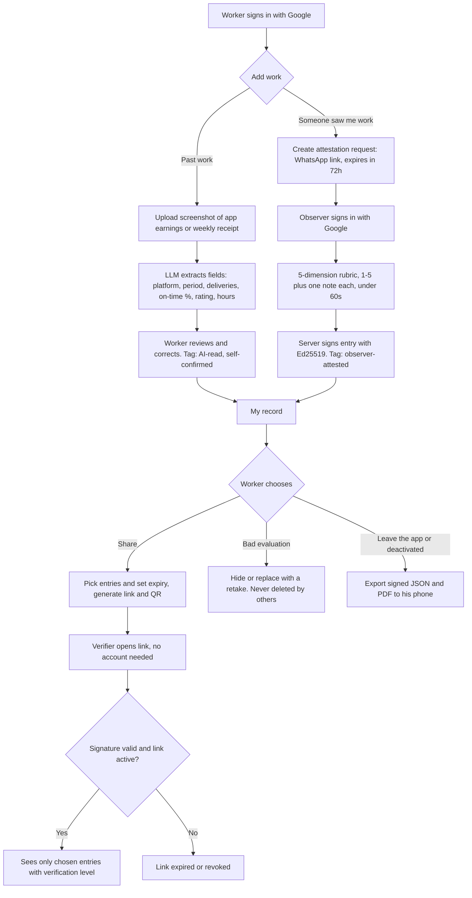
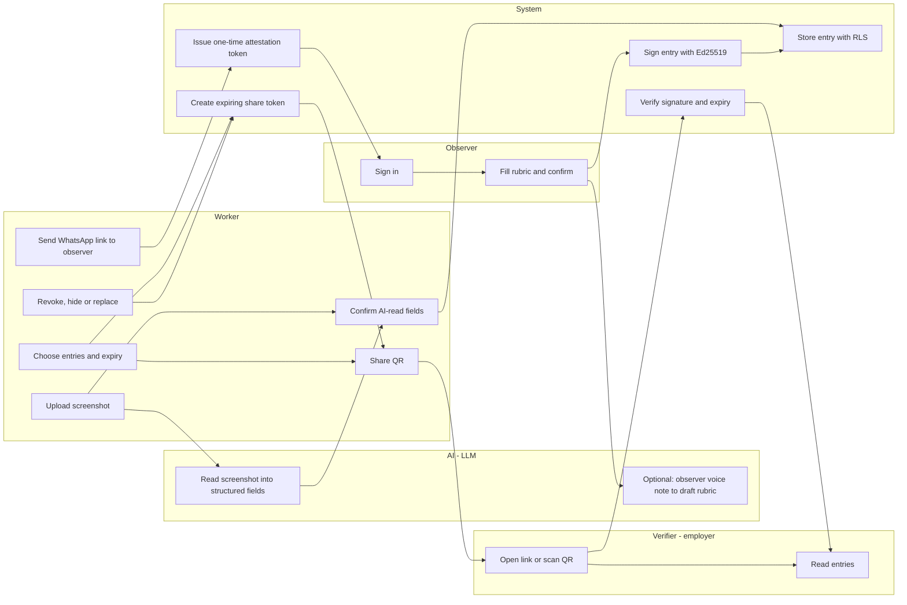

# PACKET — Week 9 · Business Bending · Josep Ferré Gil (USER)

**Working name:** Peldaño — *tu trabajo ya cuenta*
**Vacuum:** FIRST-PROOF · **Blueprint declaration:** USER → worker-owned, verifiable record of real informal work · **Honors:** Condition 1 (Shadow Clause), plus Conditions 4 and 5 where they apply.

---

## 1. Problem (in my words)

A 22-year-old in Iztapalapa has delivered food for two years. That is about 2,500 timestamped, rated deliveries. A warehouse in a nearshoring park still rejects him for lacking *"experiencia comprobable."* His experience exists, but it lives in someone else's database. The app can delete it the day it deactivates him, and an employer can't verify it. CV builders make this worse: they let him *describe* work, and employers stopped trusting descriptions long ago. What he lacks is **proof issued by someone who watched him work, held on his own phone, and shown only to whoever he chooses.**

## 2. Exact user

**Primary: the worker.** Iván (hypothesis persona, not yet interviewed), 22, Iztapalapa. He finished prepa and has delivered for DiDi Food and Rappi for 2 years, about 25 h/week. Some months he falls below the IMSS threshold, so those months leave no formal record. He uses an Android phone, WhatsApp all day, and a Google account. He distrusts long forms.

**Secondary actors:**
- **Observer:** someone who saw him work and is willing to sign for it, such as a slice supervisor, a store manager he delivered for, or the owner of the family business he helped in.
- **Verifier:** the warehouse HR person who receives his link or QR and has about 30 seconds to look at it.

**Open assumption (Blueprint BET):** Iván is *excluded*, not an *exiter*. The interview this week answers it:
- "Si mañana te ofrecen un trabajo formal que paga lo mismo, ¿lo tomas?"
- "¿Cómo te enteraste de lo del IMSS?"
- "¿Alguna vez te pidieron experiencia que sí tenías pero no podías demostrar?"

## 3. Success definition

> **Before the module closes, this works at the live URL:**
> 1. A worker signs in with Google and adds one **work-history entry** from a screenshot of his app earnings or weekly receipt. The AI reads the screenshot into structured fields, the screen labels them as AI-read, and the worker confirms them.
> 2. He sends a **WhatsApp link** to an observer, who signs in and completes a 5-dimension rubric in under 60 seconds. This creates a **signed, observer-attested entry**.
> 3. He creates an **expiring share link and QR** with only the entries he picks. A verifier opens it without an account and sees those entries, each with its verification level and a valid signature.
> 4. He **revokes** the link and it stops working. He **hides or replaces** an evaluation and it disappears from new shares. No aggregate score exists anywhere.

## 4. Mockup (image-generated)

`docs/mockup.png`, generated with this prompt:

> Mobile app screen, Android, Spanish UI, clean and friendly, large type for slow readers, warm orange and deep blue palette. Title "Mi historial". Three stacked cards:
> (1) "Repartidor · DiDi Food · mar 2024 – feb 2026 · 2,480 entregas · 96% a tiempo" with a grey tag "Leído por IA · confirmado por mí".
> (2) "Conteo de inventario · Tienda Ejemplo · 3 sep 2026" with five small labeled bars: Puntualidad, Precisión, Ritmo, Trato, Instrucciones, a green tag "Verificado por quien lo vio" and a shield icon.
> (3) A dashed card "+ Agregar trabajo".
> Bottom: a big button "Compartir con un empleador" with a QR icon. No overall score anywhere. Invented data.

## 5. Flow

### 5a. Flowchart — how the feature works

### 5b. Swimlane — who does what

## 6. Benchmark

- **The best existing solution on Earth for this is** Harambee in South Africa. It assesses young workseekers and shares comparable results with both them and employers, which raised employment and earnings (Carranza, Garlick, Orkin & Rankin). Pallais's oDesk experiment backs the same idea: detailed public evaluations of a first job roughly tripled inexperienced workers' earnings.
- **Mine differs or localizes by** starting from work the informal worker *already does* (platform history plus observers from his real life), not a test center. The proof is issued by whoever watched the work, lives on his phone instead of the platform's servers, and is distributed through WhatsApp, the channel he actually uses.

## 7. Long view (3 years)

If this slice works, Peldaño becomes the default way a historyless Mexican worker carries proof. That proof would come from platforms (pulled from the IMSS data they already report), from Operator-style paid slices, and from employers who observed him. Employers who sign the experience waiver would accept "N verified entries" in place of "2 años de experiencia," which is the mechanism the 2026 bill banning experience requirements needs in order to work. The load-bearing walls I'm keeping deliberate from day one are: **the worker owns the record, observers issue it, there is no aggregate score, and every share is revocable.**

## 8. Scope cut — what I'm NOT building

- ❌ **No CV builder.** The LLM never writes prose about the worker, never "improves" claims, and never infers skills. It only reads documents into fields that he confirms, and drafts rubrics that the observer confirms.
- ❌ **No job board**, no listings, no matching to vacancies.
- ❌ No paid slices, scheduling or payments. Those belong to Operator and Money, and Conditions 2 and 3 live there.
- ❌ No direct integration with DiDi, Rappi or IMSS. The worker uploads his own documents (platforms can block scraping, per Adversary).
- ❌ No blockchain, no badges, no single score or ranking.
- ❌ No CURP or biometric verification. Identity this week is Google sign-in for worker and observer, flagged as a known limit.
- ❌ No native app. It's a mobile-first web app.

## 9. Architecture + stack (free tier only)

| Layer | Choice | Why |
|---|---|---|
| Frontend + API | Next.js (App Router) on **Vercel** | Free, 2+ deploys trivial, env vars for secrets |
| Auth | **Supabase Auth**, Sign in with Google | Security floor; also gives observer identity |
| Database | **Supabase Postgres + RLS** | Worker sees only his rows |
| File storage | Supabase Storage, private bucket, RLS by owner | Screenshots are personal data |
| LLM (vision + text) | **Gemini free tier** (fallback: Groq) | Reads screenshots, structures voice-note rubric |
| Verified data | Ed25519 signatures (Node `crypto`), private key in Vercel env | Entries are tamper-evident, verifier checks |
| Automation | Expiring share tokens, one-time attestation tokens, WhatsApp deep links (`wa.me`) | Revocable sharing; no WhatsApp API cost |
| QR | `qrcode` npm | Verifier scans from his phone |

**Dragon Stack:** LLM (extraction + rubric drafting) + structured/verified data (signed entries) + automation (expiring tokens, WhatsApp handoff).

### Data model

- `profiles` (id = auth.uid, display_name, created_at)
- `entries` (id, owner_id, type: `platform_history` | `observer_attestation`, fields jsonb, verification: `ai_read_self_confirmed` | `observer_attested`, observer_id null, status: `active` | `hidden` | `replaced`, replaces_id null, signature, signed_payload_hash, created_at)
- `attestation_requests` (token_hash, owner_id, context text, expires_at, used_at)
- `share_links` (token_hash, owner_id, entry_ids uuid[], expires_at, revoked_at)

**RLS:** `entries`, `share_links` and `attestation_requests` are readable and writable only where `owner_id = auth.uid()`. An observer can insert one attestation only through a server route that validates an unused, unexpired token. The public verifier page reads through a server route using the share token. It never queries tables directly from the client.

### Security floor checklist

- 🔑 Gemini key and Ed25519 private key live only in Vercel env, and `.env*` is in `.gitignore`.
- 🔐 Google auth is required for worker and observer.
- 🚪 RLS is on for every table, tested with two accounts.
- 🧹 Zod validates every form: lengths, 1–5 integers, image type and size ≤ 5 MB. LLM output is schema-validated before saving, and user text goes to the prompt only as quoted data.
- 🎭 Seeds and demo use invented people and invented screenshots, labeled "DATOS DE EJEMPLO."
- 🏷️ Every AI-read field shows the tag "Leído por IA — confírmalo." If the LLM is unavailable, a simulated output is shown and labeled "SIMULADO."

## 10. Blueprint conditions → how this build honors them

| Condition | In this build |
|---|---|
| **1. Shadow Clause** | The record lives with the worker and can be exported as signed JSON/PDF, so deactivation can't erase it. He picks what each verifier sees. Hide/replace lets him retake a bad evaluation. There is no aggregate score in the UI, API or database. |
| 2. Signed next step | Out of scope: no slice tracks are created here. |
| 3. Slice pay floor | Out of scope: no slices are paid here. |
| **4. Detailed evaluation by the observer** | 5 dimensions, each 1–5 plus a note. Only the person who observed the work can issue it, never the worker. Cross-supervisor calibration is noted as a limit. |
| **5. Identity + data law** | Google identity for both sides. Minimal data, private storage, explicit consent before each share, and a delete-my-account route. |

## 11. Test plan

### Mechanical pass

1. Sign in with Google, then sign out. Visiting `/historial` logged out redirects to sign-in.
2. Upload a valid screenshot: the fields appear tagged as AI-read, he edits one, saves, and it appears in the record.
3. Upload a 10 MB file or a PDF: it's rejected with a clear Spanish message.
4. The LLM returns malformed JSON: the schema rejects it and the UI asks him to fill the fields manually.
5. Create an attestation link, then the observer completes it. The entry shows as observer-attested with a signature.
6. Reuse the same attestation link: rejected. Use an expired one: rejected.
7. The worker tries to attest himself with his own account: rejected.
8. Share 1 of 3 entries: the verifier sees exactly 1, and the signature shows valid.
9. Change one byte of the signed payload in the DB: the verifier shows "firma inválida."
10. Revoke the link: the verifier sees "enlace revocado." An expired link shows "enlace vencido."
11. Hide an entry: it doesn't appear in new shares.
12. **RLS:** account B can't read account A's entries through the API or a direct Supabase query.
13. `git log -p | grep -i key` finds no secrets.

At least one bug is found, fixed and redeployed, and logged in DECISIONS.md.

### Persona test (Layer 1)

In a fresh chat: *"You are Iván, 22, Iztapalapa, delivers for DiDi Food and Rappi in the evenings. You use WhatsApp all day, distrust long forms, read fast but skip anything that looks like paperwork, and quit if an app asks for your CURP or bank info. You've been rejected for 'no experience' twice."* Paste screenshots in order: sign-in → empty record → upload → confirm fields → send to observer → share QR. Log every hesitation. Fix the worst one before the deadline.

A second persona tests the verifier: *"You are Laura, HR at a logistics warehouse in Tepotzotlán, 40 applications a day, 30 seconds each."*

## 12. Commit plan (≥ 5 commits, ≥ 2 deploys)

1. Scaffold Next.js, Supabase client, Google auth, RLS migrations → **deploy 1**
2. Screenshot upload, LLM extraction, confirm, save entry
3. Ed25519 signing plus attestation request and observer rubric
4. Share links, QR, public verifier page, revoke/hide/replace
5. Signed export, validation hardening, and labels → **deploy 2**
6. Persona-test fix → **deploy 3**

Every session ends with DECISIONS.md updated, the next session's first move noted, commit, push.
